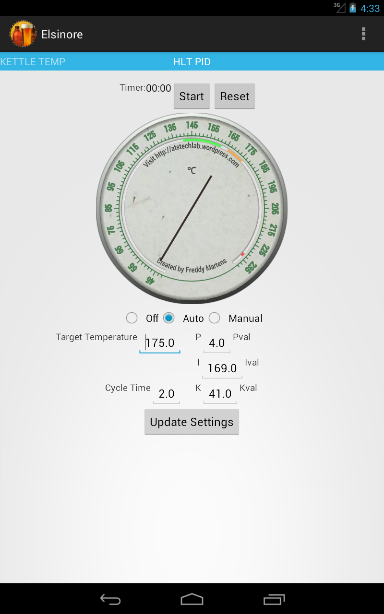
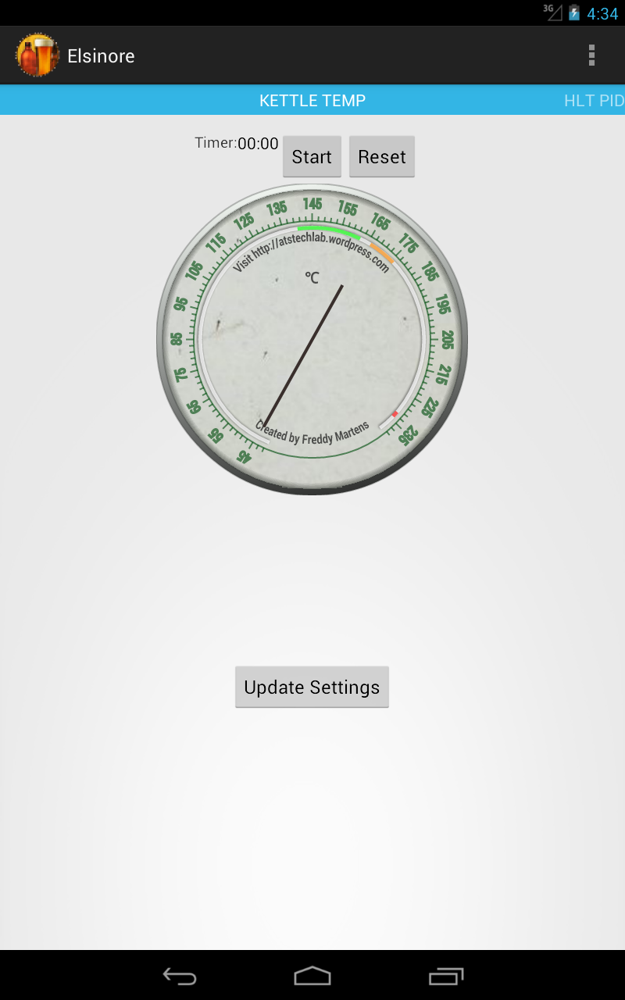

StrangeBrew Elsinore Server
===========================

StrangeBrew Controller for Electric Breweries using Rasbperry Pi and 1-wire


Setting Up
==========

Wiring


Modify the existing rpibrew.cfg (which I have provided as an example) to setup the initial values and what you have installed, for example, for the HLT:

```
[hlt]
set_point = 168.0 << Target Temperature when in Auto Mode
duty_cycle = 100.0 << Amount of time the system is on (%) in Manual mode
cycle_time = 2.0 << Time between cycles of on/off (s)
k_param = 41.0 << PID Params
i_param = 169.0
d_param = 4.0
probe = 28-0000032c449f << 1 Wire probe address
gpio = 11 << wiringPi GPIO output pin
```

Start the process using:

> sudo java -cp framboos-0.0.1-SNAPSHOT.jar:ini4j-0.5.2.jar:json-simple-1.1.1.jar:. LaunchControl

The output will display the status.

Basic JSON output is:

```
{"hlt_pid":
	{"elapsed":1362949226111,"scale":"F","cycle":2.0,"duty":0.0,"p":4.0,"gpio":11,"temp":44.6,"setpoint":175.0,"k":41.0,"i":169.0,"mode":"off"},
	
"kettle_temp":
	{"elapsed":1362949226921,"scale":"F","temp":44.4866}
}
```
I have a basic Android app uploaded as well: 
[Strangewbrew Elsinore for Android] (https://github.com/DougEdey/SB_Elsinore_Android)




I've designed it to run on Nexus 7 tablets using Android 4.0.4+ Settings are simple, just setting the hostname/port at the moment, with a refresh rate.

There's a basic timer, I'll be adding alerts in soon.

Since this is early days develeopment, it must be expected that there will be bugs! But please file a bug report, or better yet, a bug fix with a pull request.

I do have a Web UI on the way (a friend is redeveloping the original interface since it was functional but ugly.

A BB app is coming too.


Long term I will be providing a Image file for the raspberry pi which'll allow you to run quickly!
